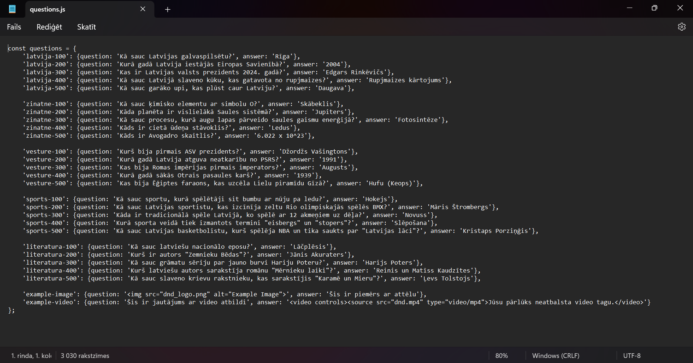

# Viktorīna

Viktorīnai ir līdzība ar jeopardy spēli un lietotājs var izveidot pats savu spēli un šī ir pamācība kā to izdarīt.

1. **Lejupielādē zip failu** no saites https://github.com/ITspecialitate/jeopardy/tree/main
2. **Atver failu questions.js**  Šeit Jūs varat rediģēt savus jautājumus.
3. **Atveriet index.html** un ja ir nepieciešams rediģējat sadaļu virsrakstus. 

Ja neesat iepriekš saskāries ar programmēšanu, tad es iesaku neaiztikt `id` t. i. 

index.html 

questions.js 
