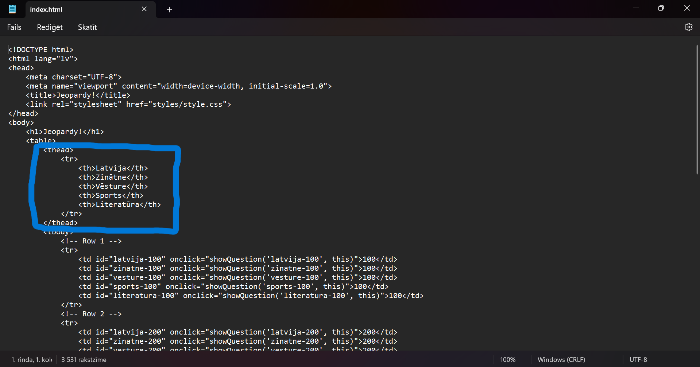
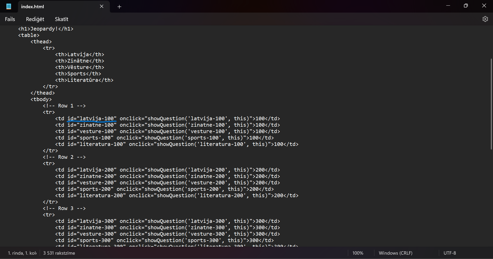
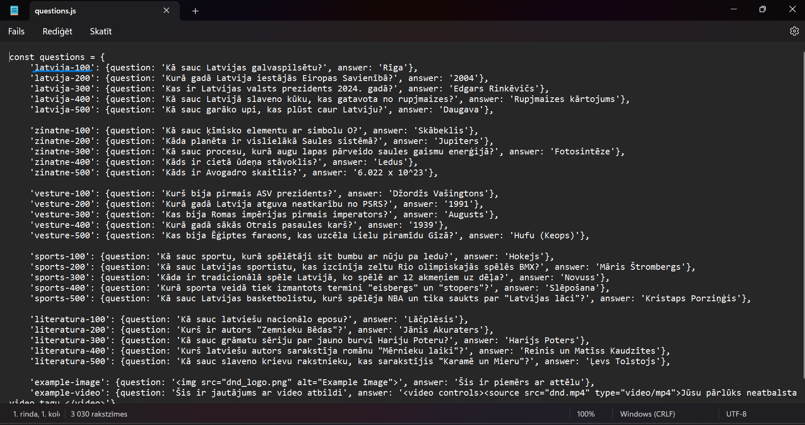

# Viktorīna

Viktorīnai ir līdzība ar jeopardy spēli un lietotājs var izveidot pats savu spēli un šī ir pamācība kā to izdarīt.

1. **Lejupielādē zip failu** no saites https://github.com/ITspecialitate/jeopardy/archive/refs/heads/main.zip
2. **Atver failu questions.js**  Šeit Jūs varat rediģēt savus jautājumus.
   
## Kā rediģēt questions.js?

* Rediģējot jautājumus un atbildes ir jāaceras, ka drīkst rediģēt tikai to, kas atrodas vienpēdiņās.
* Nav ieteicams rediģēt/izmainīt `id`
* Ja vēlaties ievietot attēlu
* Ja vēlaties ievietot video 

4. **Atveriet index.html** un ja ir nepieciešams rediģējat sadaļu virsrakstus. 

Ja neesat iepriekš saskāries ar programmēšanu, tad es iesaku neaiztikt `id` t. i. 

index.html 

questions.js 
